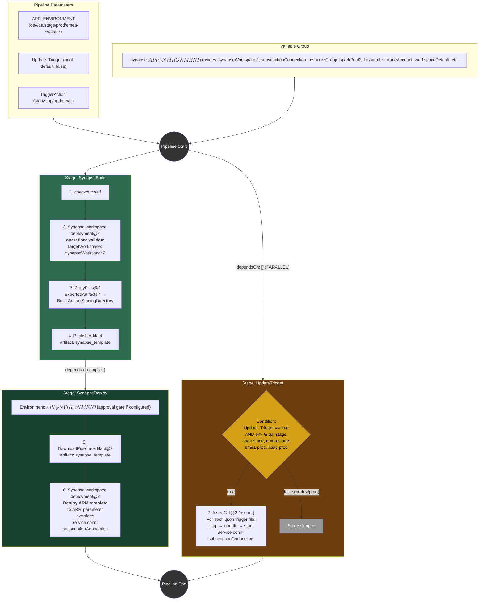

# Azure Synapse Pipeline Analysis

## A) Pipeline Overview

- **Purpose:** Build, validate, and deploy an Azure Synapse Analytics workspace using ARM-template-based deployment, with optional trigger management.
- **Pool:** Microsoft-hosted `Azure Pipelines` agent pool (no custom container).
- **No CI/PR triggers defined** — this pipeline is **manual-run only** (queue-time parameters).
- **3 parameters:** `APP_ENVIRONMENT` (8 environments), `Update_Trigger` (bool), `TriggerAction` (start/stop/update/all).
- **1 variable group** per environment: `synapse-<env>` — supplies all connection strings, workspace names, resource groups, etc.
- **3 stages:** `SynapseBuild` → `SynapseDeploy` → `UpdateTrigger` (conditional, runs **in parallel** with the other two due to `dependsOn: []`).
- **Deployment environment** with potential approval gates on `SynapseDeploy` (environment: `${{ parameters.APP_ENVIRONMENT }}`).
- **6 templates** in `templates/` — all are simple step templates (no nested template calls).
- **Key risk:** `UpdateTrigger` stage has `dependsOn: []`, meaning it starts immediately and does **not** wait for the deploy to finish.
- **Unused template:** `templates/show-synapse-pipeline.yaml` (AzureCLI list pipelines) is never called.

---

## B) Expanded Sequential Flow

### Stage 1: `SynapseBuild` (unconditional, no dependsOn — runs first)

**Job: `Build`** (runs on `Azure Pipelines` pool)

| # | Step | Source | Effective Detail |
|---|------|--------|-----------------|
| 1 | `checkout: self` | inline | Clones the repository to `$(System.DefaultWorkingDirectory)` |
| 2 | **Synapse workspace deployment@2** (validate) | `templates/validate-synapse-workspace.yml` | `operation: validate`, `ArtifactsFolder: $(System.DefaultWorkingDirectory)`, `TargetWorkspaceName: $(synapseWorkspace2)` — validates the Synapse workspace JSON artifacts against the target workspace schema |
| 3 | **CopyFiles@2** | `templates/copy-files.yml` | Copies `ExportedArtifacts/*` and `TemplateParametersForWorkspace*.json` to `$(Build.ArtifactStagingDirectory)` |
| 4 | **Publish Pipeline Artifact** | `templates/publish-synapse.yml` | Publishes `$(Build.ArtifactStagingDirectory)` as artifact named `synapse_template` |

### Stage 2: `SynapseDeploy` (implicit dependsOn: `SynapseBuild` — runs after Stage 1 succeeds)

**Deployment Job: `deployWorkspace`** (display: "Synapse Deployment")

- **Environment:** `${{ parameters.APP_ENVIRONMENT }}` (e.g., `dev`, `qa`, `prod`…) — **approval checks may be configured on the environment resource in ADO**.
- **Strategy:** `runOnce` → `deploy`

| # | Step | Source | Effective Detail |
|---|------|--------|-----------------|
| 5 | **DownloadPipelineArtifact@2** | `templates/download-artifact.yml` | Downloads artifact `synapse_template` to `$(Pipeline.Workspace)/synapse_template` |
| 6 | **Synapse workspace deployment@2** (deploy) | `templates/deploy-synapse-workspace.yml` | Deploys ARM template to the Synapse workspace (details below) |

**Step 6 — Resolved Inputs:**

| Input | Resolved Value |
|-------|---------------|
| `TemplateFile` | `$(Pipeline.Workspace)/synapse_template/ExportedArtifacts/TemplateForWorkspace.json` |
| `ParametersFile` | `$(Pipeline.Workspace)/synapse_template/ExportedArtifacts/TemplateParametersForWorkspace.json` |
| `azureSubscription` | `$(subscriptionConnection)` |
| `ResourceGroupName` | `$(resourceGroup)` |
| `TargetWorkspaceName` | `$(synapseWorkspace2)` |
| `DeleteArtifactsNotInTemplate` | `false` |

**Step 6 — ARM Parameter Overrides (13 total):**

| ARM Parameter | Resolved Value | Category |
|---------------|---------------|----------|
| `DataTransformation_properties_bigDataPool_referenceName` | `$(sparkPool2)` | Spark Pool |
| `experiment-ripunjaya_properties_bigDataPool_referenceName` | `$(sparkPool2)` | Spark Pool |
| `experiment_properties_bigDataPool_referenceName` | `$(sparkPool2)` | Spark Pool |
| `mount_properties_bigDataPool_referenceName` | `$(sparkPool2)` | Spark Pool |
| `Transformation_Master_properties_bigDataPool_referenceName` | `$(sparkPool2)` | Spark Pool |
| `config_properties_bigDataPool_referenceName` | `$(sparkPool2)` | Spark Pool |
| `main_properties_bigDataPool_referenceName` | `$(sparkPool2)` | Spark Pool |
| `transform_properties_bigDataPool_referenceName` | `$(sparkPool2)` | Spark Pool |
| `Transformation_Generic_Cleaned_properties_bigDataPool_referenceName` | `$(sparkPool2)` | Spark Pool |
| `incremental_value_update_properties_bigDataPool_referenceName` | `$(sparkPool2)` | Spark Pool |
| `LS_AzureKeyVault_properties_typeProperties_baseUrl` | `$(keyVault)` | Key Vault |
| `LS_AzureDataLakeStorage_properties_typeProperties_url` | `$(storageAccount)` | Data Lake Storage |
| `LS_AzureDataLakeStorage_key_properties_typeProperties_url` | `$(storageAccount)` | Data Lake Storage |
| `u2zjcuqfaddl001-WorkspaceDefaultSqlServer_connectionString` | `$(workspaceDefault)` | SQL Server |
| `LS_AzureBlobStorage_Search_properties_typeProperties_serviceEndpoint` | `$(searchStorageAccount)` | Blob Storage |

### Stage 3: `UpdateTrigger` (CONDITIONAL — runs in PARALLEL, `dependsOn: []`)

**Condition (compile-time):**

```
Update_Trigger == true
AND APP_ENVIRONMENT IN (qa, stage, apac-stage, emea-prod, apac-prod, emea-stage)
```

**Excluded environments:** `dev` and `prod` — triggers cannot be updated for these.

**Job: `TriggerUpdate`** (runs on `Azure Pipelines` pool)

| # | Step | Source | Effective Detail |
|---|------|--------|-----------------|
| 7 | **AzureCLI@2** (PowerShell Core) | `templates/synapse-trigger.yaml` | Uses `$(subscriptionConnection)` service connection. Iterates over all `.json` files in `$(filePath)` directory. For each file, based on `TriggerAction`: |

**Step 7 — Trigger Action Logic:**

| TriggerAction value | Operations performed (per `.json` file) |
|---------------------|----------------------------------------|
| `stop` | `az synapse trigger stop` |
| `update` | `az synapse trigger update` (with JSON file content) |
| `start` | `az synapse trigger start` |
| `all` (default) | `stop` → `update` → `start` (all three, in order) |

---

## C) ADO Task Inventory

| Task | Version | Used In | Purpose | Key Inputs | Changes | Service Connection |
|------|---------|---------|---------|------------|---------|-------------------|
| **Synapse workspace deployment** | `@2` | Stage 1, Step 2 | Validate Synapse workspace artifacts against target | `operation: validate`, `ArtifactsFolder`, `TargetWorkspaceName` | None (validation only) | None |
| **CopyFiles** | `@2` | Stage 1, Step 3 | Copy exported ARM artifacts to staging directory | `Contents` (glob), `TargetFolder` | Artifacts staged locally | None |
| **Publish Pipeline Artifact** | built-in | Stage 1, Step 4 | Publish build artifacts to pipeline | `artifact` name, source path | Creates pipeline artifact `synapse_template` | None |
| **DownloadPipelineArtifact** | `@2` | Stage 2, Step 5 | Download artifact from earlier stage | `artifactName`, `downloadPath` | Extracts artifact to deploy agent | None |
| **Synapse workspace deployment** | `@2` | Stage 2, Step 6 | Deploy ARM template to Synapse workspace | `TemplateFile`, `ParametersFile`, `OverrideArmParameters`, `ResourceGroupName`, `TargetWorkspaceName`, `DeleteArtifactsNotInTemplate` | **Infra**: Deploys/updates Synapse workspace resources (linked services, notebooks, Spark pool configs, pipelines) | `$(subscriptionConnection)` |
| **AzureCLI** | `@2` | Stage 3, Step 7 | Stop/update/start Synapse triggers via Azure CLI | `scriptType: pscore`, `inlineScript` (iterates JSON files) | **App**: Modifies Synapse trigger state and definitions | `$(subscriptionConnection)` |

---

## D) Risks / Footguns

- **`UpdateTrigger` runs in parallel with Build/Deploy** — `dependsOn: []` removes the implicit sequential dependency. If someone enables `Update_Trigger=true` while also deploying, triggers may be modified on the *old* workspace state before the deploy finishes. This is almost certainly a bug unless the trigger definitions are intentionally decoupled from the workspace deployment.
- **No CI/PR triggers** — the pipeline has no `trigger:` or `pr:` block, so it will only execute when manually queued. If the org has implicit CI triggers enabled in ADO settings, it could fire on every push to any branch.
- **`dev` and `prod` excluded from trigger updates** — the condition on `UpdateTrigger` deliberately excludes `dev` and `prod`. If trigger management is needed for those environments, it must be done out-of-band.
- **`DeleteArtifactsNotInTemplate: false`** — orphaned Synapse artifacts (pipelines, notebooks, linked services, etc.) that are removed from source control will **not** be cleaned up from the workspace. This can lead to drift between repo and live environment.
- **Variable group secrets are implicit** — all connection strings, Key Vault URLs, and service connection names come from `synapse-<env>` variable groups. If a variable group is misconfigured or missing a variable, the pipeline will fail at runtime with a hard-to-diagnose empty-string substitution.
- **No Spark pool / Key Vault existence check** — the deploy blindly overrides 10 Spark pool references and a Key Vault URL. If the target environment's Spark pool or Key Vault doesn't exist, the ARM deployment will fail.
- **Trigger action default is `all`** — the default `TriggerAction` = `all` performs **stop → update → start** for every trigger. Accidentally running with the default on a production environment will restart all triggers.
- **Unused template** — `templates/show-synapse-pipeline.yaml` exists but is never referenced, creating dead code.
- **No rollback mechanism** — if the Synapse workspace deployment fails partway through, there is no automatic rollback stage or saved previous state.
- **Environment approval is the only gate** — there are no explicit pre-/post-deployment checks, integration tests, or smoke tests. The deployment environment's approval configuration (if any) in ADO is the sole gate for production.
- **Hardcoded ARM parameter override keys** — the 13+ `OverrideArmParameters` entries are hardcoded. If a new notebook/pipeline is added to the Synapse workspace that references a Spark pool, it must be manually added to `deploy-synapse-workspace.yml` or it will retain the source workspace's pool name.

---

## E) Flow Diagram



---

## F) Template Resolution Map

All template references were resolved successfully. No nested templates exist.

| Calling Location | Template Reference | Parameters Passed |
|------------------|--------------------|-------------------|
| `synapse.yml` Stage 1, Step 2 | `templates/validate-synapse-workspace.yml` | `target_workspace: $(synapseWorkspace2)` |
| `synapse.yml` Stage 1, Step 3 | `templates/copy-files.yml` | `target_folder: $(Build.ArtifactStagingDirectory)` |
| `synapse.yml` Stage 1, Step 4 | `templates/publish-synapse.yml` | `artifact_directory: $(Build.ArtifactStagingDirectory)`, `artifact_name: synapse_template` |
| `synapse.yml` Stage 2, Step 5 | `templates/download-artifact.yml` | `artifact-name: synapse_template`, `download_path: $(Pipeline.Workspace)/synapse_template` |
| `synapse.yml` Stage 2, Step 6 | `templates/deploy-synapse-workspace.yml` | `template_file`, `parameters_file`, `azure_subscription`, `resource_group`, `target_workspace`, `spark_pool`, `key_vault`, `storage_account`, `workspace_default`, `search_storage_account` (all from variable group) |
| `synapse.yml` Stage 3, Step 7 | `templates/synapse-trigger.yaml` | `azure_subscription: $(subscriptionConnection)`, `synapseWorkspace: $(synapseWorkspace2)`, `directory_path: $(filePath)`, `action: ${{ parameters.TriggerAction }}` |
| *(orphaned)* | `templates/show-synapse-pipeline.yaml` | **Not referenced from any pipeline** |
