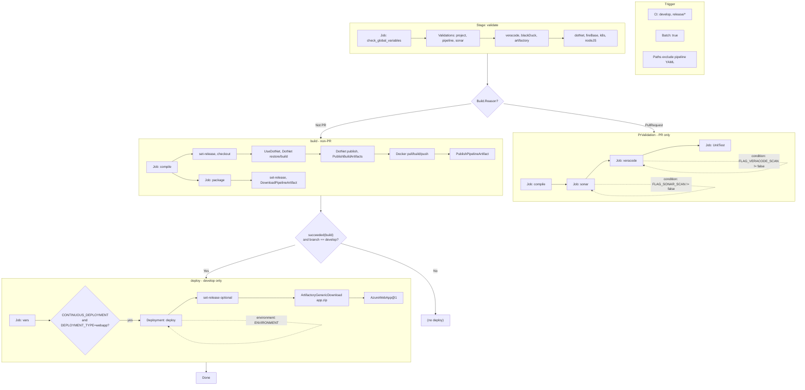

# LEAP-API Azure Pipeline – End-to-End Analysis

## A) Pipeline Overview

- **Trigger**: CI on branches `develop` and `release/*`; **batch** mode; paths exclude pipeline/variable YAML files and alternate pipeline files.
- **No PR trigger in main file**: PR behavior comes from template `pipeline.yml` (stage **PrValidation** runs only when `Build.Reason == 'PullRequest'`); this pipeline does **not** define `pr:` in the root, so PR runs depend on Azure DevOps project/default PR trigger if enabled.
- **Parameters**: Pipeline passes `APP_DIR: ''` and `NPMRC_CLEAR: ''` into `templates/main/pipeline.yml@AzureTemplates`; all other behavior is driven by variables.
- **Variables**: From **ado-vars.yml** (local) and variable group **leap-common**; pool overridden to **dds-concourse-ubuntu2004-01** in root (ado-vars defines `pool: ubuntu-latest`).
- **Template repo**: **AzureTemplates** → `InfraDevOps/ado-templates`, ref **refs/heads/feature/leap-test**; `@Self` in templates resolves to the **calling** repo (LEAP-API) for `ado-vars.yml`.
- **Stages**: **validate** → **PrValidation** (PR only) **or** **build** (non-PR) → **deploy** (only when branch is `develop` and build succeeded; deploy jobs only if `CONTINUOUS_DEPLOYMENT == true` and `DEPLOYMENT_TYPE == 'webapp'`).
- **Key config**: `BUILD_TYPE: dotNetCore`, `ARTIFACT_TYPE: docker`, `DEPLOYMENT_TYPE: webapp`; Docker image built and pushed to Artifactory; deploy expects **app.zip** from Artifactory and uses **Azure Web App** task (with **ENVIRONMENT** and Azure service connection from variable group).
- **Risks**: Deploy uses **webapp** path (downloads **app.zip** from Artifactory) while main build produces a **Docker** artifact and pipeline artifact **drop**; **RuntimeStack** in shared template is hardcoded `NODE|14-lts` (mismatch for .NET). Variable group **leap-common** must define `CONTINUOUS_DEPLOYMENT`, `ENVIRONMENT`, `AZURE_SERVICE_CONNECTION`/`WEBAPP_NAME`, etc., for deploy to work.

---

## B) Expanded Sequential Execution Flow

**Effective parameters to pipeline template:** `APP_DIR: ''`, `NPMRC_CLEAR: ''`  
**Variable resolution:** `ado-vars.yml` + group `leap-common`; pool = `dds-concourse-ubuntu2004-01`.

---

### 1. Stage: **validate** (always)

- **1.1 Job: check_global_variables**
  - Variables: template `ado-vars.yml@Self` (path = `ado-vars.yml` from LEAP-API).
  - **Steps:**
    1. **variables-validation.yml** → runs validation templates in order, passing `${{ variables }}`:
       - project-vars-validation, pipeline-vars-validation, sonar-vars-validation, veracode-vars-validation, blackDuck-vars-validation, artifactory-vars-validation, dotNet-vars-validation, fireBase-vars-validation, kubernetes-vars-validation, nodeJS-vars-validation.
       - Each uses basic steps (e.g. non-empty, enum, boolean) implemented as **bash** scripts that can call `##vso[task.complete result=Failed;]` on failure.

---

### 2a. Stage: **PrValidation** — condition: `Build.Reason == 'PullRequest'`

- **2a.1 Job: compile** (same as build’s compile; see 3.1).
- **2a.2 Job: sonar** — `dependsOn: compile`, condition: `Build.Reason == 'PullRequest'` and `FLAG_SONAR_SCAN != 'false'`.
  - set-release → download-artifact → **SonarQubePrepare@5**, **SonarQubeAnalyze@5**, **SonarQubePublish@5** (config from `sonar-project.properties`; optional IP whitelist bash when `SONAR_URL == 'https://stage-sonar.pwc.com'`).
- **2a.3 Job: veracode** — `dependsOn: compile`, condition: `Build.Reason == 'PullRequest'` and `FLAG_VERACODE_SCAN != 'false'`.
  - set-release → download-artifact → **bash** (download pipeline-scan, run Veracode scan with `VERACODE_API_ID` / `VERACODE_API_KEY`).
- **2a.4 Job: UnitTest** — `dependsOn: compile`, condition: `Build.Reason == 'PullRequest'`.
  - set-release → download-artifact → **unit-test.yml** (bash: run dotnet/npm/maven unit test per `BUILD_TYPE`) → **publish-unit-test.yml** (**PublishTestResults@2**, **PublishCodeCoverageResults@1**).

---

### 2b. Stage: **build** — condition: `Build.Reason != 'PullRequest'`

- **2b.1 Job: compile**
  - Variables: `ado-vars.yml@Self`; workspace clean: all.
  - **Steps (concise):**
    1. **Bash** `env` (non-Windows only).
    2. Optional checkout infra repo if `CHECKOUT_INFRA_REPO == 'true'`.
    3. **set-release.yml** (bash blocks setting APP_VERSION, REPO_NAME, DOCKERFILE_PATH, ARTIFACTORY_HOST, defaults for TEST_RESULT_*, JACOCO_*, etc.).
    4. **checkout: self** → `s/$(REPO_NAME)`.
    5. **Bash** echo branch.
    6. **dotNetCore path:** **UseDotNet@2** → **DotNetCoreCLI@2** restore → **DotNetCoreCLI@2** build → **DotNetCoreCLI@2** publish (docker: to artifactstagingdirectory) → **PublishBuildArtifacts@1** (publish staging dir).
    7. **Docker path:** **ArtifactoryDocker@1** pull (if `DOCKER_IMAGE_DEPENDENCY_NAME` set) → **Docker@2** build (Dockerfile from repo, tags `$(APP_VERSION)`) → **ArtifactoryDocker@1** push (non-PR only).
    8. **publish.yml** → **PublishPipelineArtifact@1** (targetPath = repo `$(APP_DIR)`, name = `$(SERVICE_NAME)-$(APP_VERSION)-drop`).

- **2b.2 Job: package** — `dependsOn: compile`, condition: `succeeded()` and `Build.Reason != 'PullRequest'`.
  - Variables: `ado-vars.yml@Self`; workspace clean: all.
  - **Steps:** Optional infra checkout → **set-release.yml** → **download-artifact.yml** (DownloadPipelineArtifact@2 for `$(SERVICE_NAME)-$(APP_VERSION)-drop`).
  - For LEAP-API (`DEPLOYMENT_TYPE: webapp`, `ARTIFACT_TYPE: docker`): no update-k8s-manifest, zip-artifacts, firebase, azPublish, or argocd steps run; job only sets release and downloads the drop artifact.

---

### 3. Stage: **deploy** — condition: `succeeded('build')` and `Build.SourceBranchName == 'develop'`; `dependsOn: build`

- **3.1** Job **vars**: variables from `ado-vars.yml@Self` (no steps).
- **3.2** Deployment jobs only if `CONTINUOUS_DEPLOYMENT == true` and `DEPLOYMENT_TYPE == 'webapp'`:
  - **webapp-deployment-job.yml** (with `APP_DIR` from parameters):
    - **deployment: deploy**, **environment: $(ENVIRONMENT)** (approvals/checks on environment).
    - Steps: optional **set-release.yml** if `APP_VERSION` not passed → **generic-download.yml** (**ArtifactoryGenericDownload@1**: download `app.zip` from Artifactory) → **webapp-deploy.yml** (**AzureWebApp@1**: deploy `**/app.zip` to Web App; slot variant if `WEBAPP_SLOT` set).
    - **Note:** `app.zip` is expected in Artifactory at `$(ARTIFACTORY_GENERIC_REPO)/$(ARTIFACTORY_GENERIC_REPO_PATH)/$(SERVICE_NAME)/$(APP_VERSION)/app.zip`. LEAP-API build produces Docker image and pipeline/drop artifact; no step in this pipeline publishes `app.zip` to that path (potential gap unless another process or variable group config provides it).

---

## C) ADO Task Inventory

| Task / Step | Purpose | Key Inputs | Changes (infra/app/artifact) | Service / connection |
|-------------|---------|------------|------------------------------|----------------------|
| **Bash** (validations) | Validate required/optional variables | Variable values from pipeline | None (fails task on validation error) | — |
| **UseDotNet@2** | Set .NET SDK version | `DOTNET_VERSION` (e.g. 6.x) | Agent | — |
| **DotNetCoreCLI@2** | Restore, build, publish | Solution/projects, config, `APP_DIR` | Build output, artifact staging | — |
| **PublishBuildArtifacts@1** | Publish build output to pipeline | `build.artifactstagingdirectory` | Pipeline artifact (default name) | — |
| **ArtifactoryDocker@1** (pull) | Pull base image from Artifactory | `DOCKER_ARTIFACTORY_SERVICE_CONNECTION`, image name/repo | Agent image cache | Artifactory (e.g. svc-pwc-us-digital-devops-rw-artifactory) |
| **Docker@2** | Build image | Dockerfile path, build args, tags | Image in agent cache | — |
| **ArtifactoryDocker@1** (push) | Push image to Artifactory | Service connection, target repo, image:tag | Artifactory Docker repo | Artifactory |
| **PublishPipelineArtifact@1** | Publish drop for downstream | Workspace path, artifact name | Pipeline artifact (drop) | — |
| **DownloadPipelineArtifact@2** | Download drop in package/deploy path | Artifact name, path | Workspace | — |
| **SonarQubePrepare@5** | Configure Sonar analysis | SonarQube service connection, config file | — | LEAP-NGC-SONAR |
| **SonarQubeAnalyze@5** | Run analysis | — | — | SonarQube |
| **SonarQubePublish@5** | Publish quality gate | — | — | SonarQube |
| **Bash** (Veracode) | Run Veracode pipeline scan | `VERACODE_SCANFILE`, API id/key | Scan results | Veracode API |
| **Bash** (unit test) | Run unit tests by build type | `BUILD_TYPE`, `UNIT_TEST_CMD` | — | — |
| **PublishTestResults@2** | Publish test results | Test result format/files, search folder | Test results in pipeline | — |
| **PublishCodeCoverageResults@1** | Publish coverage | JaCoCo paths | Coverage in pipeline | — |
| **ArtifactoryGenericDownload@1** | Download app.zip from Artifactory | Service connection, file spec (repo/path) | `app.zip` in workspace | GENERIC_ARTIFACTORY_SERVICE_CONNECTION |
| **AzureWebApp@1** | Deploy to Azure Web App | Subscription, app name, package, settings, runtime | Web App (app/slot) | AZURE_SERVICE_CONNECTION |

---

## D) Risks and Footguns

- **Template ref typo:** In templates, `${{ parameters.APP_DIR }}ado-vars.yml@Self` concatenates with no separator; when `APP_DIR` is `''` path is `ado-vars.yml`; if `APP_DIR` had a value without trailing slash, path would be wrong.
- **Branch-only deploy:** Deploy runs only when `Build.SourceBranchName == 'develop'`; release branches do not deploy from this pipeline.
- **app.zip vs Docker:** Deploy uses **webapp** path and expects **app.zip** in Artifactory; main pipeline produces **Docker** image and **drop** pipeline artifact. No step here publishes **app.zip** to Artifactory — deploy will fail unless **app.zip** is supplied elsewhere or variable group/pipeline is changed.
- **RuntimeStack mismatch:** **webapp-deploy.yml** hardcodes `RuntimeStack: 'NODE|14-lts'`; LEAP-API is .NET. Override via **WEBAPP_SETTINGS** or change template for .NET runtime.
- **ENVIRONMENT / approvals:** Deploy job uses `environment: $(ENVIRONMENT)`; approvals and checks are on the environment (variable group **leap-common** must set **ENVIRONMENT**).
- **Variable group scope:** **leap-common** must define at least: **CONTINUOUS_DEPLOYMENT**, **ENVIRONMENT**, **AZURE_SERVICE_CONNECTION**, **WEBAPP_NAME**, **WEBAPP_TYPE**, **WEBAPP_DEPLOYMENT_METHOD**, and optionally **WEBAPP_SLOT**, **WEBAPP_SETTINGS**.
- **Template ref:** Pipeline pins **AzureTemplates** to **feature/leap-test**; changes in that branch affect all runs.
- **Sonar/Veracode:** Sonar uses **sonar-project.properties** in repo; Veracode needs **VERACODE_API_ID** / **VERACODE_API_KEY** (typically from Key Vault or secret variables). **FLAG_VERACODE_SCAN** is false in ado-vars; **FLAG_SONAR_SCAN** is true.
- **Concurrency:** Trigger is **batch: true** (batched CI); no explicit lock or pool limit beyond pool name.
- **Secret handling:** Sonar/Veracode/Artifactory/Azure credentials come from service connections and variable groups; ensure no secrets in **ado-vars.yml** (it has placeholders only).

---

## Template Reference Summary

- **Root:** `azure-pipelines.yml` → variables: `ado-vars.yml`, group `leap-common`; stages: `templates/main/pipeline.yml@AzureTemplates`.
- **AzureTemplates (ado-templates):**
  - `templates/main/pipeline.yml` → validate.yml, PrValidation (compile-job, pr-job), build (compile-job, package-job), deploy-stage.yml.
  - `validate.yml` → stage validate, job check_global_variables → variables-validation.yml → validations (project, pipeline, sonar, veracode, blackDuck, artifactory, dotNet, fireBase, kubernetes, nodeJS).
  - `compile-job.yml` → set-release.yml, checkout, dotnet-build.yml, dotnet-publish.yml, docker-pull.yml, docker-build.yml, docker-push.yml, publish.yml (plus conditional maven/node/vue/yarn and replaceTokens).
  - `pr-job.yml` → jobs sonar, veracode, UnitTest (set-release, download-artifact, sonarqube/veracode/unit-test, publish-unit-test).
  - `package-job.yml` → set-release, download-artifact, conditionals for k8s/firebase/zip/azPublish/argocd (none apply for LEAP-API).
  - `deploy-stage.yml` → stage deploy → webapp-deployment-job.yml → set-release, generic-download.yml, webapp-deploy.yml.

All referenced template paths under **ado-templates** were resolved; none are missing.

---

## E) Pipeline Flow Diagram (Mermaid)

