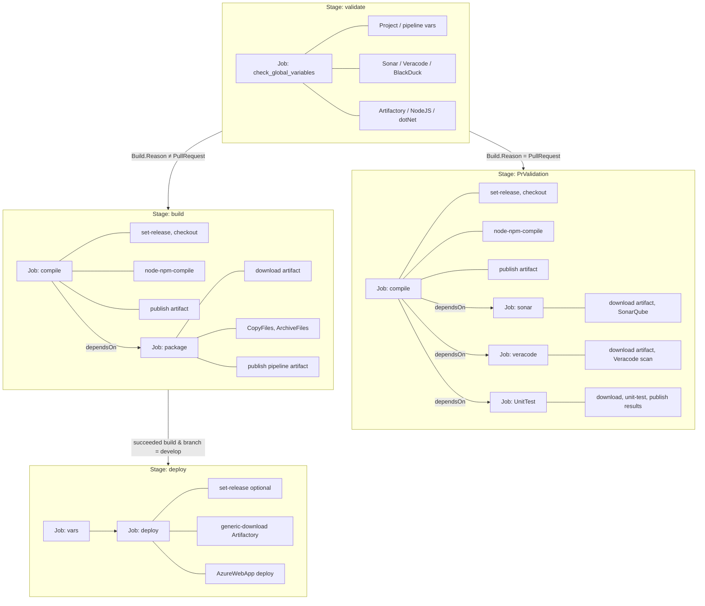

# LEAP-Host Azure DevOps Pipeline – End-to-End Analysis

**Main pipeline:** `azure-pipelines.yml` (LEAP-Host repo)  
**Template repo:** `InfraDevOps/ado-templates` (ref: `refs/heads/feature/leap`)

---

## A) Pipeline Overview

- **Entry point:** `azure-pipelines.yml` in LEAP-Host. Single stage that delegates to `templates/main/pipeline.yml@AzureTemplates`.
- **Triggers:** Batch CI on branch `develop`; paths `mfe-azure-pipelines.yml` and `blackduck-pipeline.yml` excluded. No PR trigger in main pipeline (PR behavior comes from template conditions).
- **Parameters passed to template:** `APP_DIR: ''`, `NPMRC_CLEAR: ''`, `NPMRC_CREATE: ''` (all from root; pipeline template has no top-level parameters, so these are used inside jobs via `parameters.APP_DIR` and variables).
- **Variables:** From `ado-vars.yml` (LEAP-Host) plus variable groups `leap-common` and `LEAP Common Configs`. Key settings: `BUILD_TYPE: nodejs`, `ARTIFACT_TYPE: azPublish`, `DEPLOYMENT_TYPE: webapp`, `COMPILE_JOB: true`, `FLAG_SONAR_SCAN: false`, `FLAG_VERACODE_SCAN: true`, `FLAG_BLACKDUCK_SCAN: true`, `NPMRC_CREATE: true`.
- **Pool:** `dds-concourse-ubuntu2004-01`; workspace clean: all.
- **Template repo resource:** `AzureTemplates` → `InfraDevOps/ado-templates` (ref `feature/leap`). All `template: ...@AzureTemplates` resolve under that repo; `@Self` resolves to LEAP-Host (e.g. `ado-vars.yml`).
- **Execution shape:** Validate → then either PR path (compile + PR jobs: sonar/veracode/UnitTest) or non-PR path (compile → package → optional deploy). Deploy runs only when `succeeded('build')`, branch `develop`, and `CONTINUOUS_DEPLOYMENT == true` (variable not set in `ado-vars.yml`; must come from variable groups if deploy is used).
- **Deployment target:** Azure Web App via `AzureWebApp@1`; deploy job uses `generic-download.yml` (Artifactory) then `webapp-deploy.yml`. Environment from `$(ENVIRONMENT)` (not in `ado-vars.yml`; from variable groups).
- **Important external dependencies:** Artifactory (NPM, generic zip), Veracode (pipeline scan), optional SonarQube/Black Duck; Azure subscription via `AZURE_SERVICE_CONNECTION` / `WEBAPP_NAME` for deploy.

---

## B) Expanded Sequential Flow

**Resolved parameters at template call:**  
`APP_DIR` = `''` (empty) everywhere.

**Variable resolution note:** Jobs use `${{ parameters.APP_DIR }}ado-vars.yml@Self` → `ado-vars.yml@Self` (LEAP-Host repo), so job-level variables are from LEAP-Host `ado-vars.yml` (and variable groups at pipeline level).

---

### Stage 1: validate

- **Condition:** None (always runs).
- **Job: check_global_variables**
  - Variables: `ado-vars.yml@Self` (LEAP-Host).
  - Steps (from `variables-validation.yml`):
    1. `project-vars-validation.yml` → PROJECT_NAME, SERVICE_NAME (non-empty).
    2. `pipeline-vars-validation.yml` → COMPILE_JOB (boolean); BUILD_TYPE (enum); WORKING_DIRECTORY (if nodejs/vuejs); ARTIFACT_TYPE (enum); CONTINUOUS_DEPLOYMENT / DEPLOYMENT_TYPE if set; CHECKOUT_INFRA_REPO if set.
    3. `sonar-vars-validation.yml` → runs only when Sonar is used (LEAP has FLAG_SONAR_SCAN: false, so may be no-op or optional).
    4. `veracode-vars-validation.yml` → when FLAG_VERACODE_SCAN is true: VERACODE_URL, VERACODE_SERVICE_CONNECTION, **VERACODE_PROJECT_NAME** (not set in ado-vars – **can fail**).
    5. `blackDuck-vars-validation.yml` → when FLAG_BLACKDUCK_SCAN is true: BLACKDUCK_PROJECT, BLACKDUCK_URL, **BLACKDUCK_TOKEN**, **BLACKDUCK_VERSION** (token/version empty or missing in ado-vars – **can fail**).
    6. `artifactory-vars-validation.yml` → ARTIFACTORY_GENERIC_REPO_PATH, GENERIC_ARTIFACTORY_SERVICE_CONNECTION.
    7. `dotNet-vars-validation.yml`, `fireBase-vars-validation.yml`, `kubernetes-vars-validation.yml`, `nodeJS-vars-validation.yml` → conditional validations (nodeJS checks BUILD, YARN_VERSION if applicable).

---

### Stage 2: PrValidation

- **Condition:** `eq(variables['Build.Reason'], 'PullRequest')`.
- **Job 1: compile** (template: `compile-job.yml`)
  - Steps: Check variables (bash) → `set-release.yml` → checkout self to `s/$(REPO_NAME)` → echo branch → (COMPILE_JOB true, BUILD_TYPE nodejs) → `node-npm-compile.yml` (NodeTool, NPMRC_CREATE → `npmrc-create.yml`, Npm install, Npm build) → `publish.yml` (PublishPipelineArtifact).
- **Job 2: sonar**
  - **Condition:** `and(eq(Build.Reason,'PullRequest'), ne(FLAG_SONAR_SCAN,'false'))`. With LEAP `FLAG_SONAR_SCAN: false` → **job skipped**.
- **Job 3: veracode**
  - **Condition:** `and(eq(Build.Reason,'PullRequest'), ne(FLAG_VERACODE_SCAN,'false'))` → **runs on PR**. Depends on compile. Steps: set-release → download-artifact → script pwd → `veracode-pipeline-scan.yml` (bash: download pipeline-scan, run java -jar with VERACODE_API_ID/VERACODE_API_KEY from service connection).
- **Job 4: UnitTest**
  - **Condition:** `eq(Build.Reason,'PullRequest')`. Depends on compile. Steps: set-release → download-artifact → `unit-test.yml` (bash npm run test) → `publish-unit-test.yml` (PublishTestResults, PublishCodeCoverageResults).

---

### Stage 3: build (non-PR)

- **Condition:** `ne(variables['Build.Reason'], 'PullRequest')`.
- **Job 1: compile**  
  Same as PrValidation compile: set-release → checkout → node-npm-compile (NodeTool, npmrc-create, Npm install, Npm build) → publish (pipeline artifact).
- **Job 2: package**
  - **Condition:** `and(succeeded(), ne(Build.Reason,'PullRequest'))`, depends on compile.
  - Steps: set-release → download-artifact → (DEPLOYMENT_TYPE webapp → no k8s/firebase; ARTIFACT_TYPE azPublish) → **publish-artifacts.yml**: CopyFiles (to ArtifactStagingDirectory), ArchiveFiles (zip), **publish** pipeline artifact `$(APP_VERSION)-drop`.  
  - **No Artifactory upload** in this path; zip is only a pipeline artifact.

---

### Stage 4: deploy

- **Condition:** `and(succeeded('build'), eq(Build.SourceBranchName,'develop'))`, depends on stage **build**.
- **Jobs:** Only if `CONTINUOUS_DEPLOYMENT == true` (not in ado-vars; from variable groups). For `DEPLOYMENT_TYPE: webapp` → **webapp-deployment-job.yml**.
- **Job: vars**  
  Sets vars via `ado-vars.yml@Self`.
- **Deployment job: deploy**
  - **Environment:** `$(ENVIRONMENT)` (from variable groups).
  - Steps: set-release (if APP_VERSION not passed) → **generic-download.yml** (ArtifactoryGenericDownload: `.../$(SERVICE_NAME)/$(APP_VERSION)/app.zip` → app.zip) → **webapp-deploy.yml** (AzureWebApp@1: azureSubscription, appName, package `**/app.zip`, WEBAPP_SETTINGS, etc.).
- **Gap:** Build/package publish only pipeline artifact; deploy downloads from **Artifactory**. So either variable groups configure a different flow, or an upload step is elsewhere, or deploy is not used (CONTINUOUS_DEPLOYMENT false).

---

## C) ADO Task Inventory

| Task | Purpose | Key inputs | What it changes | Service connection / notes |
|------|--------|------------|------------------|----------------------------|
| **Bash** (inline) | set-release (APP_VERSION, REPO_NAME, defaults), validations (non-empty, enum), Veracode scan script, unit-test script | Variables from ado-vars / variable groups | Pipeline variables (setvariable), validation fail | — |
| **NodeTool@0** | Use Node version | NODE_VERSION (e.g. 16.x) | Agent Node | — |
| **pwsh** (PowerShell) | npmrc-create: create .npmrc with Artifactory registry + auth | ARTIFACTORY_HOST, ARTIFACTORY_NPM_REPO, NPM_Token, APP_DIR | .npmrc in working dir | NPM token from vars/Key Vault |
| **Npm@1** | install / ci / custom build | workingDir, command, customCommand (e.g. run build:dev) | node_modules, build output | — |
| **ArtifactoryNpm@2** | (If PKG_TYPE artpkg) install/ci from Artifactory | artifactoryService, sourceRepo, workingFolder, buildName/Number, projectkey | node_modules | ARTIFACTORY_SERVICE_CONNECTION |
| **ArtifactoryPublishBuildInfo@1** | (If artpkg) publish build info | artifactoryService, buildName, buildNumber, projectkey | Artifactory build info | ARTIFACTORY_SERVICE_CONNECTION |
| **ArtifactoryXrayScan@1** | (If artpkg) Xray scan | artifactoryService, projectKey, buildName, buildNumber | Scan results in Artifactory | ARTIFACTORY_SERVICE_CONNECTION |
| **PublishPipelineArtifact@1** | Publish build output (publish.yml) | targetPath, artifactName | Pipeline artifact | — |
| **CopyFiles@2** | Copy to ArtifactStagingDirectory (publish-artifacts) | SourceFolder, Contents, TargetFolder | Staging directory | — |
| **ArchiveFiles@2** | Create zip | rootFolderOrFile, archiveFile | .zip file | — |
| **DownloadPipelineArtifact@2** | Download artifact (package job, PR jobs) | artifact, path | Workspace | — |
| **ArtifactoryGenericDownload@1** | Download app.zip from Artifactory (deploy) | artifactoryService, fileSpec (pattern/target) | app.zip in workspace | GENERIC_ARTIFACTORY_SERVICE_CONNECTION |
| **AzureWebApp@1** | Deploy to Azure Web App | azureSubscription, appName, package, deploymentMethod, appType, AppSettings/slotName | Azure Web App | AZURE_SERVICE_CONNECTION |
| **PublishTestResults@2** | Publish unit test results (PR) | testResultsFormat, testResultsFiles, searchFolder | Test results in pipeline | — |
| **PublishCodeCoverageResults@1** | Publish coverage (PR) | codeCoverageTool, summaryFileLocation, pathToSources, reportDirectory | Coverage in pipeline | — |
| **SonarQubePrepare@5** | (PR, if Sonar enabled) prepare analysis | SonarQube, scannerMode, configFile | — | SONAR_SERVICE_CONNECTION |
| **SonarQubeAnalyze@5** | Run Sonar analysis | — | — | — |
| **SonarQubePublish@5** | Publish quality gate | — | — | — |
| **Veracode** | No ADO task; bash + java -jar pipeline-scan.jar | VERACODE_SCANFILE, VERACODE_API_ID, VERACODE_API_KEY (from service connection) | Scan results in Veracode | VERACODE_SERVICE_CONNECTION (LEAP VeraCode Service) |

**Not used in LEAP-Host path but present in templates:** Docker@2, ArtifactoryDocker@1, Maven@3, DotNetCoreCLI@2, KubernetesManifest@0, AzureCLI@2, AzureFunctionApp@1, Firebase/CmdLine/DownloadSecureFile, etc.

---

## D) Operational Details

- **Environments / approvals:** Deploy job uses `environment: $(ENVIRONMENT)`. Approvals/checks are on that environment in ADO (not in YAML).
- **Variable groups:** `leap-common`, `LEAP Common Configs` – likely hold CONTINUOUS_DEPLOYMENT, ENVIRONMENT, AZURE_SERVICE_CONNECTION, WEBAPP_NAME, WEBAPP_DEPLOYMENT_METHOD, WEBAPP_TYPE, and secrets (NPM token, Veracode, etc.).
- **Key Vault:** Referenced in ado-vars (SECRETS_KEY_VAULT_*) but not used in the templates we traced; may be used by variable groups.
- **Artifacts:** Build publishes pipeline artifact `$(SERVICE_NAME)-$(APP_VERSION)-drop` (compile) and `$(APP_VERSION)-drop` (package). Deploy expects zip in **Artifactory** at `$(ARTIFACTORY_GENERIC_REPO)/$(ARTIFACTORY_GENERIC_REPO_PATH)/$(SERVICE_NAME)/$(APP_VERSION)/app.zip` – no upload in azPublish path.
- **Containers:** No container job/image in this pipeline.
- **Terraform / K8s / kubectl:** Not used for LEAP-Host (DEPLOYMENT_TYPE webapp).
- **Azure:** Subscription via AZURE_SERVICE_CONNECTION; Web App name/slot from WEBAPP_NAME, WEBAPP_SLOT.

---

## E) Risks and Footguns

- **Validate stage can fail:** With `FLAG_VERACODE_SCAN: true`, veracode-vars-validation requires **VERACODE_PROJECT_NAME** (not in ado-vars). With `FLAG_BLACKDUCK_SCAN: true`, blackDuck-vars-validation requires **BLACKDUCK_TOKEN** and **BLACKDUCK_VERSION** (empty/missing in ado-vars). Fix: set in ado-vars or variable groups, or set flags to false.
- **Deploy expects Artifactory zip:** Package job only publishes the zip as a **pipeline artifact**; deploy uses **generic-download** from Artifactory. If nothing uploads the zip to that path, deploy will fail. Fix: add ArtifactoryGenericUpload for the zip in package path, or switch deploy to DownloadPipelineArtifact and adjust path.
- **CONTINUOUS_DEPLOYMENT and ENVIRONMENT:** Not set in ado-vars. If variable groups don’t set them, deploy jobs are skipped and ENVIRONMENT is empty. Confirm groups set CONTINUOUS_DEPLOYMENT and ENVIRONMENT when deploy is desired.
- **Template ref and branch:** Templates come from `refs/heads/feature/leap`. Changes to that branch affect all consumers; pin to a tag/commit for stability.
- **@Self for ado-vars:** `${{ parameters.APP_DIR }}ado-vars.yml@Self` resolves to LEAP-Host. If APP_DIR were non-empty, path would be like `someDir/ado-vars.yml`; with APP_DIR empty, path is `ado-vars.yml` (correct). Changing APP_DIR would require a matching path in LEAP-Host.
- **npmrc-create workingDirectory:** Uses `$(APP_DIR)`; with APP_DIR empty this may be wrong. node-npm-compile uses `$(Pipeline.Workspace)/s/$(REPO_NAME)/$(APP_DIR)` for install/build; confirm APP_DIR empty is intended and workingDirectory in npmrc-create doesn’t break .npmrc location.
- **Veracode scan:** Uses VERACODE_API_ID and VERACODE_API_KEY (from service connection); VERACODE_SCANFILE defaults in set-release to `target/*.jar` (Maven). For nodejs, ado-vars doesn’t set VERACODE_SCANFILE; veracode-pipeline-scan has a branch for `source.zip` (zips .js files). Confirm scan target is correct for Node (e.g. built output or source.zip).
- **Concurrency:** Batch trigger only; no explicit lock. Multiple runs on develop can overlap; deploy uses runOnce, so last run wins for that environment.
- **Pipeline-vars enum:** BUILD_TYPE requiredEnum is `MAVEN|YARN|VUEJS|NODEJS|DOTNETCORE|PYTHON` (uppercase); ado-vars has `nodejs` (lowercase). Validation may be case-sensitive – confirm (e.g. non-empty vs enum) to avoid validate failures.

---

## Template Reference Summary

| Caller | Template | Resolved location |
|-------|----------|-------------------|
| azure-pipelines.yml | ado-vars.yml | LEAP-Host/ado-vars.yml |
| azure-pipelines.yml | templates/main/pipeline.yml@AzureTemplates | ado-templates/templates/main/pipeline.yml |
| pipeline.yml | validate.yml | ado-templates/templates/main/validate.yml |
| pipeline.yml | compile-job.yml | ado-templates/templates/main/compile-job.yml |
| pipeline.yml | pr-job.yml | ado-templates/templates/main/pr-job.yml |
| pipeline.yml | package-job.yml | ado-templates/templates/main/package-job.yml |
| pipeline.yml | deploy-stage.yml | ado-templates/templates/main/deploy-stage.yml |
| validate.yml | variables-validation.yml | ado-templates/templates/main/variables-validation.yml |
| compile-job.yml | ../lib/set-release.yml | ado-templates/templates/lib/set-release.yml |
| compile-job.yml | ../lib/node-npm-compile.yml | ado-templates/templates/lib/node-npm-compile.yml |
| compile-job.yml | ../lib/publish.yml | ado-templates/templates/lib/publish.yml |
| node-npm-compile.yml | npmrc-create.yml | ado-templates/templates/lib/npmrc-create.yml |
| package-job.yml | ../lib/download-artifact.yml | ado-templates/templates/lib/download-artifact.yml |
| package-job.yml | ../lib/publish-artifacts.yml | ado-templates/templates/lib/publish-artifacts.yml |
| pr-job.yml | ../lib/scans/veracode-pipeline-scan.yml | ado-templates/templates/lib/scans/veracode-pipeline-scan.yml |
| pr-job.yml | ../lib/unit-test.yml | ado-templates/templates/lib/unit-test.yml |
| pr-job.yml | ../lib/publish-unit-test.yml | ado-templates/templates/lib/publish-unit-test.yml |
| deploy-stage.yml | webapp-deployment-job.yml | ado-templates/templates/main/webapp-deployment-job.yml |
| webapp-deployment-job.yml | ../lib/generic-download.yml | ado-templates/templates/lib/generic-download.yml |
| webapp-deployment-job.yml | ../lib/webapp-deploy.yml | ado-templates/templates/lib/webapp-deploy.yml |
| variables-validation.yml | ../lib/validations/*.yml | ado-templates/templates/lib/validations/ |

**No template path failed** – all references resolve within LEAP-Host (`ado-vars.yml`) or ado-templates (`templates/`).

---

## F) Pipeline Flow Diagram

**Condition notes:** PrValidation runs when `Build.Reason = PullRequest`; sonar also requires `FLAG_SONAR_SCAN ≠ false` (LEAP skips). Veracode requires `FLAG_VERACODE_SCAN ≠ false`. Deploy runs when `CONTINUOUS_DEPLOYMENT` is true and `DEPLOYMENT_TYPE = webapp`.

