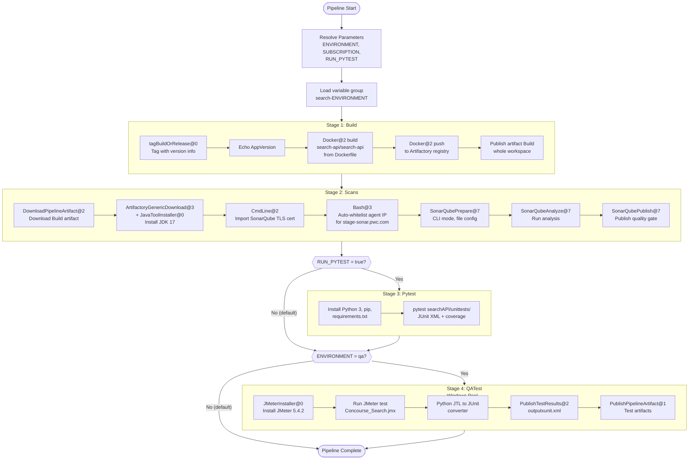

# Search-API Azure DevOps Pipeline -- Full Expanded Analysis

---

## A) Pipeline Overview

- **Project type:** Python 3.9 Flask/Connexion REST API with Datadog tracing, packaged as a Docker image.
- **Pipeline file:** [azure-pipeline.yaml](azure-pipeline.yaml) (manually triggered with parameter defaults; no explicit `trigger:` or `pr:` block, so CI trigger fires on **all branches** by default).
- **Self-hosted pool:** `dds-concourse-ubuntu2004-01` (Ubuntu 20.04); QATest stage overrides to `InfraDevOpsAgents-Windows`.
- **Template repository:** `InfraDevOps/digital-cicd` @ `develop` branch (alias `cicd`). All job-level templates live there.
- **Parameters:** `ENVIRONMENT` (9 values, default `dev`), `SUBSCRIPTION` (8 Azure service-connection names, default `concoursesearch-dev-connection`), `RUN_PYTEST` (boolean, default `false`).
- **Variable group:** `search-${{parameters.ENVIRONMENT}}` (compile-time resolved, loaded in Build stage).
- **4 stages defined:** Build, Scans, Pytest (conditional), QATest (conditional). Stages run sequentially (no explicit `dependsOn`, so ADO defaults to definition order).
- **Conditional stages (compile-time):** Pytest is removed from the plan unless `RUN_PYTEST = true`. QATest is removed unless `ENVIRONMENT = qa`.
- **Default run (ENVIRONMENT=dev, RUN_PYTEST=false):** Only **Build** and **Scans** execute.
- **Docker image pushed to:** `w00014-pwc-us-digital-devops-docker.artifacts-west.pwc.com/search-api/search-api` with tags `$(Build.SourceVersion)` and `$(Build.SourceBranchName)-$(Build.BuildNumber)`.

---

## B) Expanded Sequential Flow

### Stage 1: Build (always runs)

**Pool:** `dds-concourse-ubuntu2004-01`
**Variables:** group `search-${{parameters.ENVIRONMENT}}`
**Template chain:** `build-docker.yaml` --> `build-base.yaml` --> `package-docker.yaml`

Effective parameters after resolution:

- `cfg.type = docker`, `cfg.registry = w00014-pwc-us-digital-devops-docker.artifacts-west.pwc.com`
- `cfg.image = search-api/search-api`, `cfg.dockerfile = Dockerfile`
- `cfg.dockerBuildArguments = (empty)`, `ctx.ver = $(Build.SourceBranchName)-$(Build.BuildNumber)`

| #   | Step                                                                                                                                                                                                                                                   | Source                |
| --- | ------------------------------------------------------------------------------------------------------------------------------------------------------------------------------------------------------------------------------------------------------ | --------------------- |
| 1   | `tagBuildOrRelease@0` -- tag the build with `$(Build.SourceBranchName)-$(Build.BuildNumber)`, `ctx.ver`, `$(appId)`                                                                                                                                    | `build-base.yaml`     |
| 2   | `script: echo` the app version `ctx.ver`                                                                                                                                                                                                               | `build-base.yaml`     |
| 3   | **(no vault, no mock, no prepareSteps, no beforeBuild, no replaceVariables, no customBuild, buildSteps=[])** -- all skipped                                                                                                                            | `build-base.yaml`     |
| 4   | **Docker@2 build** -- `command: build`, registry `w00014-pwc-us-digital-devops-docker.artifacts-west.pwc.com`, repository `search-api/search-api`, Dockerfile `Dockerfile`, tags: `$(Build.SourceVersion)` + `ctx.ver`. `DOCKER_BUILDKIT=0` (default). | `package-docker.yaml` |
| 5   | **Docker@2 push** -- same registry/repository/tags as step 4.                                                                                                                                                                                          | `package-docker.yaml` |
| 6   | **publish** artifact named `Build` (source path is the workspace root since neither `cfg.rootPath` nor `ctx.rootPath` are set; publishes the **entire checkout directory**). Condition: `succeeded()`.                                                 | `build-base.yaml`     |
| 7   | **publish** artifact named `Build-Attempt$(System.JobAttempt)` -- same source. Condition: `failed()` (diagnostic artifact on failure).                                                                                                                 | `build-base.yaml`     |

---

### Stage 2: Scans (runs after Build succeeds)

**Pool:** inherited `dds-concourse-ubuntu2004-01`
**Template chain:** `scan-sonar.yaml` --> `scan-base.yaml` + `sonar-prepare.yaml` --> `install-jdk.yaml` + `task-base.yaml`

Effective parameters:

- `cfg.enabled = true`, `cfg.server = https://stage-sonar.pwc.com`
- `cfg.endpoint = sonar-service-connection`
- `cfg.projectKey = PwC-US-Digital-concoursesearch-backend-search-api`
- `cfg.configFile = $(Pipeline.Workspace)/s/sonar-project.properties`

| #   | Step                                                                                                                                                                                                                                  | Source                                         |
| --- | ------------------------------------------------------------------------------------------------------------------------------------------------------------------------------------------------------------------------------------- | ---------------------------------------------- |
| 1   | `checkout: none`                                                                                                                                                                                                                      | `scan-base.yaml`                               |
| 2   | **DownloadPipelineArtifact@2** -- download artifact `Build` from current pipeline run to `$(Build.SourcesDirectory)`. Pattern `*`*.                                                                                                   | `scan-base.yaml` --> `download-artifacts.yaml` |
| 3   | **ArtifactoryGenericDownload@3** -- download `zulu17.30.16-sa-jdk17.0.1-linux_x64.tar.gz` from `w00014-pwc-us-digital-devops-generic` Artifactory.                                                                                    | `sonar-prepare.yaml` --> `install-jdk.yaml`    |
| 4   | **JavaToolInstaller@0** -- install JDK 17 from the downloaded archive.                                                                                                                                                                | `install-jdk.yaml`                             |
| 5   | **CmdLine@2** -- import `stage-sonar.pwc.com` TLS certificate into `/tmp/trustStore.keystore` via `openssl` + `keytool`. (Condition: server = `https://stage-sonar.pwc.com` AND agent pool is not `ubuntu-latest` -- both true here.) | `sonar-prepare.yaml`                           |
| 6   | **Bash@3** -- "Sonar whitelist": checks if the agent IP can reach `stage-sonar.pwc.com`; if not, POSTs to a GCP Cloud Function to add the IP to a firewall whitelist, then polls up to 10 minutes (20 x 30s).                         | `sonar-prepare.yaml`                           |
| 7   | **SonarQubePrepare@7** (via `task-base.yaml`) -- `scannerMode: CLI`, `configMode: file`, `configFile: $(Pipeline.Workspace)/s/sonar-project.properties`, `SonarQube: sonar-service-connection`.                                       | `scan-sonar.yaml`                              |
| 8   | **SonarQubeAnalyze@7** -- runs the analysis. `jdkversion: JAVA_HOME_17_X64`.                                                                                                                                                          | `scan-sonar.yaml` (inline)                     |
| 9   | **SonarQubePublish@7** -- publishes quality gate result. `pollingTimeoutSec: 300`.                                                                                                                                                    | `scan-sonar.yaml` (inline)                     |

---

### Stage 3: Pytest (CONDITIONAL -- only if `RUN_PYTEST = true`)

**Pool:** inherited `dds-concourse-ubuntu2004-01`
**Condition:** `eq('${{ parameters.RUN_PYTEST }}', 'true')` (compile-time; stage is **removed** when false)
**Job:** `RunPytest` (inline, no template)

| #   | Step                                                                                                                                                                                                                                                                     | Source        |
| --- | ------------------------------------------------------------------------------------------------------------------------------------------------------------------------------------------------------------------------------------------------------------------------ | ------------- |
| 1   | **script** (inline) -- `sudo apt update && apt install python3 python3-pip`, `pip install -r requirements.txt`, `pip install pytest pytest-azurepipelines pytest-cov protobuf`, `pytest searchAPI/unittests/ --junitxml=junit/test-results.xml --cov=. --cov-report=xml` | main pipeline |

**Note:** No `PublishTestResults` step follows -- the JUnit XML produced by pytest is **not published** to the ADO test tab.

---

### Stage 4: QATest (CONDITIONAL -- only if `ENVIRONMENT = qa`)

**Pool:** `InfraDevOpsAgents-Windows` (override)
**Condition:** `eq('${{ parameters.ENVIRONMENT }}', 'qa')` (compile-time; stage is **removed** when false)
**Template chain:** `qa-jmeter-test.yaml` --> `qa-base.yaml`

Effective parameters (since `cfg.cmd` is set, not `cfg.docker`):

- `cfg.cmd.testDir = ./jmeter-test`
- `cfg.cmd.startCmd = jmeter -n -t QA-Automation-Scripts/Concourse_Search.jmx -l api_report.jtl`
- `cfg.cmd.reportCmd = python QA-Automation-Scripts/jtl_junit_converter.py api_report.jtl $(Pipeline.Workspace)/s/$(Build.BuildNumber)/outputxunit.xml`
- `cfg.publishResultsFile = outputxunit.xml`
- `cfg.cmd.jmeterVersion` is not set, defaults to `5.4.2`

| #   | Step                                                                                                                                                                 | Source                |
| --- | -------------------------------------------------------------------------------------------------------------------------------------------------------------------- | --------------------- |
| 1   | **JMeterInstaller@0** -- install JMeter 5.4.2                                                                                                                        | `qa-jmeter-test.yaml` |
| 2   | **script** -- `mkdir $(Pipeline.Workspace)\s\$(Build.BuildNumber)`, `cd ./jmeter-test`, run jmeter command. Display: "Run jmeter test for the Windows".              | `qa-jmeter-test.yaml` |
| 3   | **script** -- `cd ./jmeter-test`, run python JTL-to-JUnit converter. Display: "copy reports".                                                                        | `qa-jmeter-test.yaml` |
| 4   | **PublishTestResults@2** -- publish `$(Pipeline.Workspace)/s/$(Build.BuildNumber)/outputxunit.xml`. `failTaskOnFailedTests: true`. Condition: `succeededOrFailed()`. | `qa-jmeter-test.yaml` |
| 5   | **PublishPipelineArtifact@1** -- publish `$(Pipeline.Workspace)/s/$(Build.BuildNumber)` as artifact `$(Build.BuildNumber).zip`. Condition: `succeededOrFailed()`.    | `qa-jmeter-test.yaml` |

---

## C) ADO Task Inventory

| Task                           | Purpose                                                        | Key Inputs                                                                          | What It Changes                           | Service Connection                                                                |
| ------------------------------ | -------------------------------------------------------------- | ----------------------------------------------------------------------------------- | ----------------------------------------- | --------------------------------------------------------------------------------- |
| `tagBuildOrRelease@0`          | Tag the build run with version metadata                        | tags: branch-buildNumber, ctx.ver, appId                                            | ADO build metadata (tags)                 | None                                                                              |
| `Docker@2` (build)             | Build the Python API Docker image from Dockerfile              | registry, repository `search-api/search-api`, Dockerfile, `DOCKER_BUILDKIT=0`       | Local Docker images on agent              | `w00014-pwc-us-digital-devops-docker.artifacts-west.pwc.com` (container registry) |
| `Docker@2` (push)              | Push image to Artifactory Docker registry                      | Same registry/repository, tags: `$(Build.SourceVersion)` + `branchName-buildNumber` | Artifactory Docker repository             | Same container registry                                                           |
| `publish` (built-in)           | Publish build workspace as pipeline artifact `Build`           | Source: workspace root                                                              | ADO pipeline artifacts                    | None                                                                              |
| `DownloadPipelineArtifact@2`   | Download `Build` artifact from current run for scanning        | artifactName: `Build`, buildType: `current`                                         | Agent filesystem                          | None                                                                              |
| `ArtifactoryGenericDownload@3` | Download Zulu JDK 17 archive from Artifactory                  | Connection: `w00014-pwc-us-digital-devops-generic`, pattern: `jdk/zulu17...`        | Agent temp directory                      | `w00014-pwc-us-digital-devops-generic`                                            |
| `JavaToolInstaller@0`          | Install JDK 17 on the agent                                    | versionSpec: 17, jdkSource: LocalDirectory                                          | Agent tool cache (`JAVA_HOME`)            | None                                                                              |
| `CmdLine@2`                    | Import SonarQube server TLS certificate into a Java truststore | openssl + keytool commands                                                          | `/tmp/trustStore.keystore`                | None                                                                              |
| `Bash@3` (whitelist)           | Auto-whitelist agent IP for SonarQube firewall                 | curl to GCP Cloud Function, polls up to 10 min                                      | External firewall rule (GCP)              | None (uses hardcoded API key in script)                                           |
| `SonarQubePrepare@7`           | Configure SonarQube CLI scanner                                | endpoint: `sonar-service-connection`, configMode: file, projectKey                  | Agent env / SQ config                     | `sonar-service-connection`                                                        |
| `SonarQubeAnalyze@7`           | Execute SonarQube code analysis                                | jdkversion: `JAVA_HOME_17_X64`                                                      | SonarQube server (uploads analysis)       | (uses prepared config)                                                            |
| `SonarQubePublish@7`           | Publish quality gate result to ADO                             | pollingTimeoutSec: 300                                                              | ADO build extensions (quality gate badge) | (uses prepared config)                                                            |
| `script` (Pytest)              | Install Python, dependencies, and run pytest                   | `pytest searchAPI/unittests/ --junitxml --cov`                                      | Agent filesystem (installs packages)      | None                                                                              |
| `JMeterInstaller@0`            | Install Apache JMeter on Windows agent                         | jmeterVersion: `5.4.2`                                                              | Agent PATH                                | None                                                                              |
| `script` (JMeter run)          | Execute JMeter test plan against Concourse Search API          | `jmeter -n -t ...Concourse_Search.jmx`                                              | JTL results file on agent                 | None                                                                              |
| `script` (JTL convert)         | Convert JTL results to JUnit XML                               | python `jtl_junit_converter.py`                                                     | XML report on agent                       | None                                                                              |
| `PublishTestResults@2`         | Publish JUnit XML to ADO test tab                              | testResultsFiles: `outputxunit.xml`, failTaskOnFailedTests: true                    | ADO test runs                             | None                                                                              |
| `PublishPipelineArtifact@1`    | Publish JMeter test artifacts                                  | targetPath: build number directory, publishLocation: pipeline                       | ADO pipeline artifacts                    | None                                                                              |

---

## D) Risks / Footguns

- **No trigger block defined.** The pipeline defaults to CI trigger on ALL branches. Every push to any branch triggers a full Build+Scans run. This is almost certainly unintended for a production pipeline -- consider adding `trigger: none` or scoping to specific branches.
- **SUBSCRIPTION parameter is never used.** The parameter `SUBSCRIPTION` is defined with 8 service-connection values but is never referenced anywhere in the pipeline or its templates. It appears to be dead configuration.
- **Publish artifact path is empty/root.** In `build-base.yaml`, `coalesce(cfg.rootPath, ctx.rootPath)` evaluates to an empty string because neither is set. The `publish` task will attempt to publish from the default working directory, which includes the **entire checked-out repo** plus Docker build context. This could be a very large artifact.
- **Sonar configFile path may break.** The Scans stage does `checkout: none` and downloads the `Build` artifact. The configFile is set to `$(Pipeline.Workspace)/s/sonar-project.properties`, but the downloaded artifact may unpack to a different path (`$(Build.SourcesDirectory)/sonar-project.properties`). If the artifact layout doesn't match, SonarQube prepare will fail.
- **Hardcoded firewall API key in sonar-prepare.** The Sonar whitelist script contains a hardcoded key (`lncmbr5kax`) posted to a GCP Cloud Function. This is a secret in plain text in the template repo.
- **Pytest results are never published.** The Pytest stage runs `pytest --junitxml=junit/test-results.xml` but never calls `PublishTestResults@2`, so results won't appear in the ADO test tab.
- **Compile-time conditions hide stages silently.** The `${{ }}` conditions on Pytest and QATest remove those stages entirely at compile time. If someone sets `RUN_PYTEST = true` but `ENVIRONMENT = dev`, there's no indication that QATest was intentionally skipped. Consider runtime `condition:` expressions instead.
- **QATest stage runs on Windows but scripts use Unix-style paths.** The `mkdir -p $(Pipeline.Workspace)\s\...` uses backslashes (Windows-style) but `mkdir -p` is a Unix command. On a true Windows agent this may fail unless WSL/Git Bash is the default shell.
- **No concurrency control.** There is no `lockBehavior` or resource locks. Multiple runs against the same environment could push conflicting Docker images with overlapping tags.
- **Variable group `search-${{ENVIRONMENT}}` must exist for all 9 environments.** If any environment value (e.g., `apacProd`) doesn't have a corresponding variable group, the pipeline will fail at compile time.
- **Template repo pinned to `develop` branch.** Changes to `develop` in `InfraDevOps/digital-cicd` immediately affect this pipeline. There's no version pinning or tag reference.
- `**DOCKER_BUILDKIT=0` by default in package-docker.yaml.** BuildKit is disabled unless `cfg.buildkit` is set. The Dockerfile uses `COPY --from=datadog/serverless-init:1` which is a multi-stage build feature that works without BuildKit, but some optimization opportunities are lost.
- **ctx object is incomplete.** The `build-base.yaml` template uses `ctx.name`, `ctx.display`, `ctx.rootPath`, `ctx.checkout`, `ctx.artifactName` -- but the pipeline only sets `ctx.ver`. The job name and display name will evaluate to empty/null through `coalesce`, which could produce confusing job names in the ADO UI.

---

## E) Mermaid Flow Diagram

---

## Template Resolution Map (all templates found)

All referenced templates were **successfully resolved** from `InfraDevOps/digital-cicd` (main branch; pipeline references `develop`):

| Called From              | Template Reference                        | Resolved Path                              |
| ------------------------ | ----------------------------------------- | ------------------------------------------ |
| `azure-pipeline.yaml:51` | `templates/jobs/build-docker.yaml@cicd`   | `/templates/jobs/build-docker.yaml`        |
| `build-docker.yaml`      | `./build-base.yaml`                       | `/templates/jobs/build-base.yaml`          |
| `build-base.yaml`        | `../steps/package-docker.yaml`            | `/templates/steps/package-docker.yaml`     |
| `azure-pipeline.yaml:64` | `templates/jobs/scan-sonar.yaml@cicd`     | `/templates/jobs/scan-sonar.yaml`          |
| `scan-sonar.yaml`        | `./scan-base.yaml`                        | `/templates/jobs/scan-base.yaml`           |
| `scan-sonar.yaml`        | `../steps/sonar-prepare.yaml`             | `/templates/steps/sonar-prepare.yaml`      |
| `scan-sonar.yaml`        | `../steps/task-base.yaml`                 | `/templates/steps/task-base.yaml`          |
| `scan-base.yaml`         | `../steps/download-artifacts.yaml`        | `/templates/steps/download-artifacts.yaml` |
| `sonar-prepare.yaml`     | `./install-jdk.yaml`                      | `/templates/steps/install-jdk.yaml`        |
| `azure-pipeline.yaml:94` | `templates/jobs/qa-jmeter-test.yaml@cicd` | `/templates/jobs/qa-jmeter-test.yaml`      |
| `qa-jmeter-test.yaml`    | `./qa-base.yaml`                          | `/templates/jobs/qa-base.yaml`             |

**No template resolution failures.**